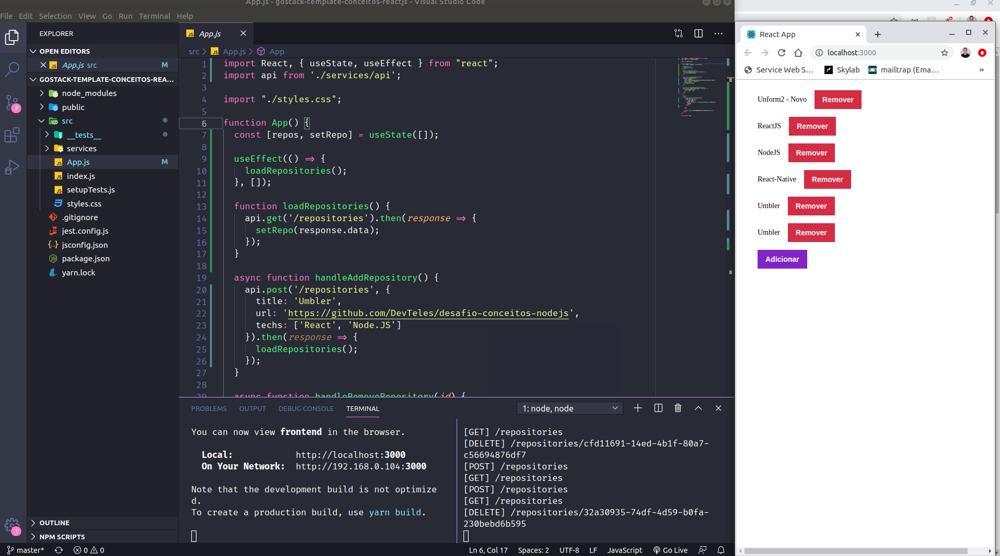

<h1 align="center">    
  
</h1>

# Indice
- [Conceito básico do React](#-Conceito-básico-do-React)
- [Tecnologias utilizadas](#-Tecnologias-utilizadas)
- [Como baixar o projeto](#-Como-baixar-o-projeto)

## Conceito básico do React

Nesse **desafio**, foi criado uma aplicação para treinar o que aprendi até mais alguns dos conceitos no ReactJS!

---

## Tecnologias utilizadas

O projeto foi desenvolvido utilizando as seguintes tecnologias

- [ReactJS](htpps://react.org)
- [Axios](htpps://github.com/axios/axios)

---
## Como baixar o projeto

```bash

  # Clonar o repositório
  $ git clone https://github.com/DevTeles/gostack-template-conceitos-reactjs.git

  # Entrar no diretório
  $ cd gostack-template-conceitos-reactjs

  # Instalar as dependências
  $ yarn

  # Iniciar o projeto
  $ yarn start
```

Desenvolvido por **Rafael Teles Vital**